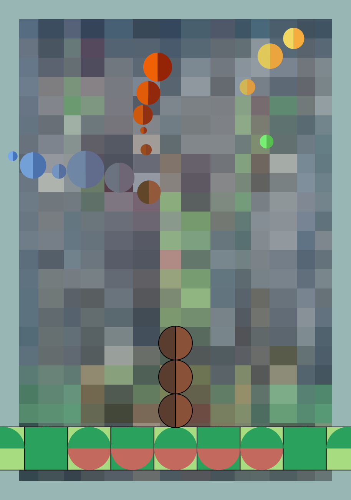

# Final Project - Time-Based Animated Tree

##  Interaction Description

This project features **time-driven animation** without any user-triggered input such as mouse or keyboard interaction.

The **tree trunk's three circular segments** appear one by one in a bouncing, enlarging motion.
Apple-like balls grow from the tree branches, also with a bouncing and scaling effect.
The animation runs continuously, with growth, transformation, and restarting phases occurring automatically.
No mouse, keyboard, or audio interaction is used — the system evolves autonomously through time.
The **mosaic background continuously flashes and shifts subtly**, keeping the entire canvas in motion.
---

##  My Contribution

I was responsible for the following two parts of the project:

### 1. Tree Base Design (`trunk_base.js`)
- Created a **9-segment rectangular base**:
  - Outer layer: light green (`#A8DC80`)
  - Inner layer: dark green (`#2AA25E`)
  - Center 5 rectangles feature semi-circular decorations in red and green.
- All shapes include **1px black stroke** for clarity and visual separation.

### 2. Trunk Circles Animation
- Implemented **3 vertically-aligned circular trunk sections** using `arc()`.
- Each circle:
  - Left half: dark brown (`#5B3D2F`)
  - Right half: light brown (`#885138`)
- Carefully controlled position and size via scaling and `offsetY` to align them flush with the base.

---

##  Animation Method & Individual Technique
My animation approach is **time-controlled bouncing scale** using `millis()` and `sin()` functions:
```js
let t = constrain(age / 800, 0, 1);
let bounce = sin(t * PI);
let grow = constrain(t + 0.3 * bounce, 0, 1);
scale(grow);
```
## Explanation

- millis() calculates the "age" of each trunk circle since its appearance started.
- sin(t * PI) produces a smooth curve for bouncing from 0 → 1 → 0.
- The grow factor combines linear progression with bounce for a more organic scaling effect.

## Difference from Teammates

| Feature              | My Implementation                                  | Teammates' Approach                             |
|---------------------|----------------------------------------------------|-------------------------------------------------|
| Timing Control       | Precise timing with 500ms delay per circle         | Mostly fixed interval or random appearance      |
| Animation Curve      | Custom `t + 0.3 * sin(t * PI)` bounce              | Standard `sin(t * PI)` scaling                  |
| Interaction Trigger  | Time-based only                                    | Some used audio input or random triggers        |
| Effect Focus         | Emphasis on structure and symmetry                 | Emphasis on variety, randomness, or response    |

## Technical Implementation

Fully implemented using p5.js only — no external libraries or frameworks used.
Used built-in functions such as:
millis(), scale(), translate(), push(), pop(), arc(), constrain(), and sin().
Maintained modular and reusable code structure.

## Visual Preview
A preview of the final animation: